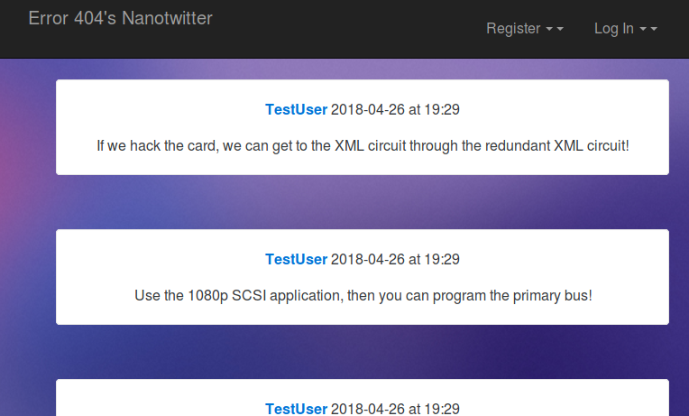
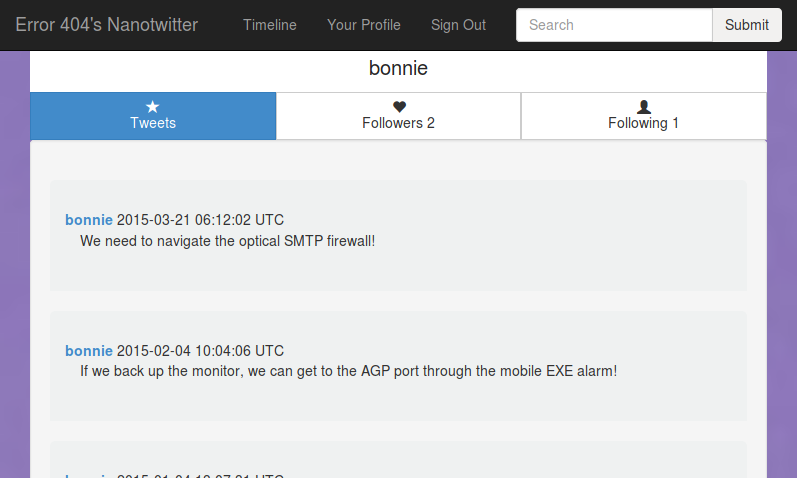

## Welcome to nanoTwitter (4.28.18)

## So, what is nanoTwitter?
Just what it sounds like! nanoTwitter is an app that replicates the core functionality of Twitter, but in a much smaller package. Users can send nanoTweets (including hashtags!), follow other users or be themselves followed, search the library of nanoTweets and users, and view timelines. This was a class project for [Cosi 105b - Software Engineering for Scalability](cosi105b.s3-website-us-west-2.amazonaws.com/), taught in the Spring of 2018 by Professor Pito Salas.

## How does it all work?
This app was programmed primarily in Ruby. It was built using Sinatra, a lightweight, domain-specific, web application framework. Though there were specific project requirements, and the app was modeled on Twitter, it was designed and built from the ground up. We use Postgres for our database, Redis for caching, and include RabbitMQ to handle authentication as a microservice. There are also many additional tools and resources we used to build nanoTwitter, but these should give you the basic idea of how it's structured.

## Some interesting technologies:
Redis: We utilize a fanout algorithm akin to actual twitter to add each new tweet to every user timeline that it needs to be added to.  We also cache the home timeline, adding tweets to it every time a new one is posted.  This means any timeline can be displayed with only a single database call.  We also cache the list of followers and following users, with a cached counter.

GraphQL:  The entire API of our NanoTwitter is built in GraphQL.  All API calls are sent to a POST '/api/v1/graphql', and the request is dirrived from the JSON body of the request.  More specifics can be found in our API documents.
Client Library as a gem:  We built a gem to interface with our NanoTwitter API.  By running gem install 'nanotwitter' in the terminal and including 'require nanotwitter' in your code!  More specific write ups can be found online at the gem's github: https://github.com/sparkit2002/nanotwitter-gem
## How does it perform?

## Designed and Programmed by...
- Elizabeth Koshelev - lizkosheleva@gmail.com
- Riely Allen
- Lara Frymark
